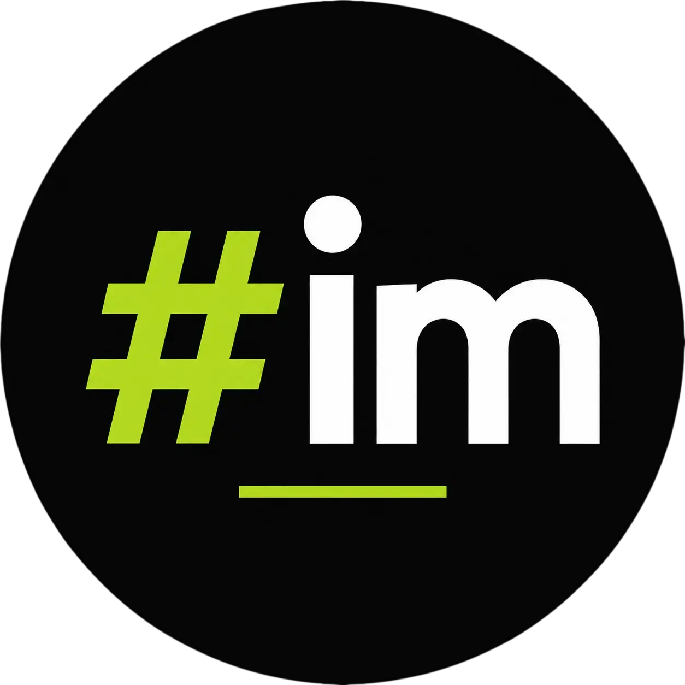

<p align="center">
  
</p>

<h3 align="center">Hashim Malik — Developer Portfolio & Standalone Workstation</h3>

<p align="center">
  A high-performance, immersive personal portfolio and standalone developer workstation engineered with <b>React 19</b>, <b>Vite</b>, <b>TailwindCSS 4</b>, and <b>Motion</b>.
</p>

---

## ✨ Features

### 1. Immersive Portfolio Experience (`/`)
- **Atmospheric Audio Engine**: Generative Web Audio API ambient soundscape with floating volume controls and easter-egg Vinyl / Minimalist audio player switcher.
- **Dynamic Preloader**: Interactive SVG cloud reveal with synchronized smooth scrolling via Lenis.
- **Interactive Project Modals**: Deep-dive project showcases with live demo links, architecture breakdowns, and tech pills.
- **AI Portfolio Assistant**: Real-time interactive AI chat agent powered by Gemini Flash and localized knowledge base.
- **Responsive Floating Dock**: Quick-access global navigation with smooth anchor scrolling and instant resume triggers.

### 2. Workstation Suite (`/tools`)
Curated standalone career acceleration utilities engineered for developers and job seekers with **automatic session persistence**:

- **📄 ATS Resume Builder (`/tools/resume-builder`)**:
  - High-precision ATS-compliant formatting across 4 curated templates (*Classic, Executive, Compact, Modern*).
  - 1-click **AI Auto-Fill** generation from raw text prompts powered by Gemini 3.6 Flash.
  - Interactive live editor with real-time text synchronization and local session retention across page reloads.
  - Instant print-ready 1-page PDF download and ATS plain-text copy.

- **✉️ AI Cold Outreach & Cover Letter Studio (`/tools/outreach-generator`)**:
  - Multi-channel campaign pack generator:
    - **Cold Emails** with 3 high-converting subject line angles and live editable subject box.
    - **LinkedIn / Twitter DMs** tailored for character limits.
    - **Formal Narrative Cover Letters** in standard 3-paragraph executive format.
    - **3–5 Day Follow-Up Sequences**.
  - **1-Click Mailto Action**: Launches your default email client (Gmail, Apple Mail, Outlook) with Recipient, Subject, and Body pre-filled.
  - Built-in starter scenarios (*Founder Pitch, High-Growth Scale-Up, Big Tech*) and instant **Clear to Scratch** / **Reset** controls.
  - Automatic `localStorage` session state retention.

---

## 🛠️ Tech Stack

- **Framework**: [React 19](https://react.dev/) + [Vite](https://vitejs.dev/)
- **Styling**: [TailwindCSS 4](https://tailwindcss.com/)
- **Animations**: [Motion](https://motion.dev/) (Framer Motion)
- **Smooth Scroll**: [Lenis](https://github.com/darkroomengineering/lenis)
- **Icons**: [Lucide React](https://lucide.dev/)
- **Export & Effects**: `html2pdf.js`, `canvas-confetti`
- **AI Providers**: Google Gemini (3.6 Flash / 3.5 Flash / Flash Latest), xAI Grok, OpenAI, DeepSeek

---

## 🚀 Quick Start

### 1. Clone the repository
```bash
git clone https://github.com/Hashimmalik46/My-Portfolio.git
cd My-Portfolio
```

### 2. Install dependencies
```bash
npm install
```

### 3. Configure Environment Variables
Copy the example `.env.example` file to `.env`:
```bash
cp .env.example .env
```
Add your optional API keys:
```env
VITE_GEMINI_API_KEY=your_gemini_api_key_here
```

### 4. Run Development Server
```bash
npm run dev
```
Open [http://localhost:5173](http://localhost:5173) in your browser.

### 5. Build for Production
```bash
npm run build
```

---

## 📁 Project Architecture

```
src/
├── components/          # Reusable UI & standalone tool components
│   ├── OutreachStudio.jsx          # AI Cold Outreach & Cover Letter Studio
│   ├── StandaloneResumeBuilder.jsx # Standalone ATS Resume Studio
│   ├── ResumeModal.jsx             # Portfolio embedded resume modal
│   ├── Hero.jsx                    # Hero header with ambient audio toggle
│   ├── Projects.jsx                # Project showcase section
│   ├── Skills.jsx                  # Interactive skill pills & metrics
│   └── ...
├── pages/               # Top-level route pages (React Router DOM)
│   ├── HomePage.jsx                # Portfolio landing page (/)
│   ├── ToolsHub.jsx                # Workstation hub (/tools)
│   ├── ResumeBuilderPage.jsx       # ATS Resume studio (/tools/resume-builder)
│   └── OutreachStudioPage.jsx      # Outreach studio (/tools/outreach-generator)
├── services/            # Multi-provider AI generation engines
│   ├── aiResume.js                 # Universal resume generation service
│   └── aiOutreach.js               # Universal outreach & cover letter service
├── data/                # Portfolio content, projects, and bio data
│   └── portfolioData.js
└── App.jsx              # Main router & Lenis smooth scroll provider
```

---

## 👤 Author

**Hashim Malik**
- Website: [hashimmalik.in](https://hashimmalik.in)
- GitHub: [@Hashimmalik46](https://github.com/Hashimmalik46)
- LinkedIn: [linkedin.com/in/hashim-malik-a868102b0](https://www.linkedin.com/in/hashim-malik-a868102b0/)
- Instagram: [@i_hash46](https://instagram.com/i_hash46)
- X / Twitter: [@hashimm447](https://x.com/hashimm447)

---

## 📄 License & Copyright

© 2026 **Hashim Malik**. All rights reserved.

The source code, designs, and assets in this repository are for personal portfolio and demonstration purposes. Unauthorized copying or redistribution of this project or its branding is prohibited without prior permission.

